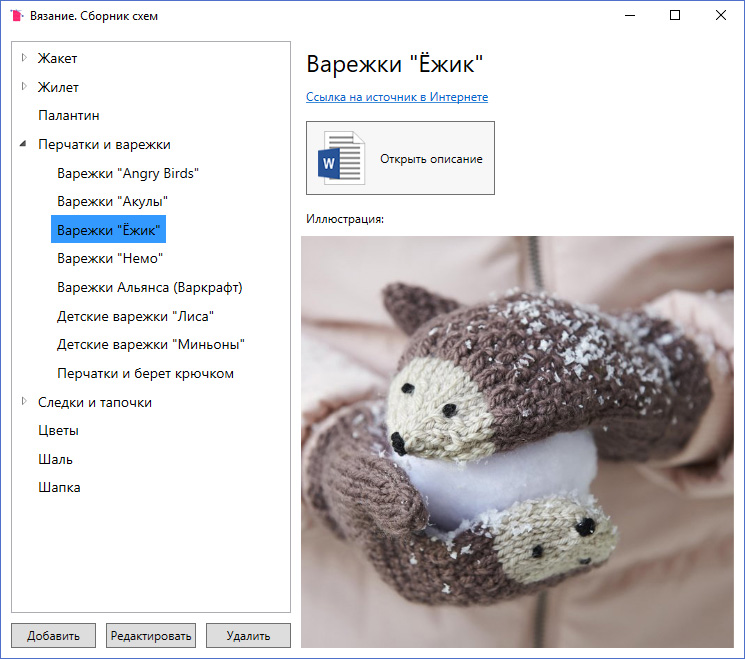

# Вязание. Сборник схем

Программа для быстрого и удобного просмотра собственной коллекции схем по вязанию.

Для хранения коллекции используется встраиваемая нереляционная база данных LiteDB.

### Скриншот


### Дополнительная информация
Для работы программы в папке с исполнительным файлом должен находиться файл библиотеки из директории
```
packages\LiteDB.4.1.1\lib\net40
```
