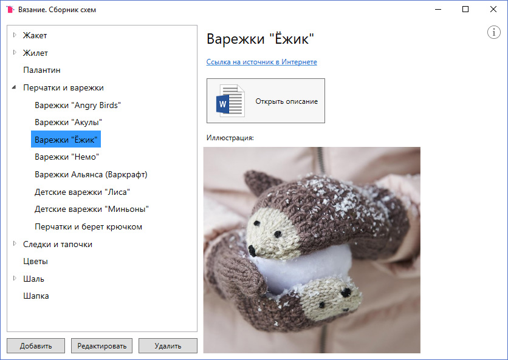

# Вязание. Сборник схем

Программа для быстрого и удобного просмотра собственной коллекции схем по вязанию.

Для хранения коллекции используется встраиваемая нереляционная база данных LiteDB.

### Скриншот


### Дополнительная информация
Программа не сохраняет в базу файлы с описанием схем, только пути их расположения.

Для работы в папке с исполнительным файлом должен находиться файл библиотеки
```
LiteDB.dll
```
